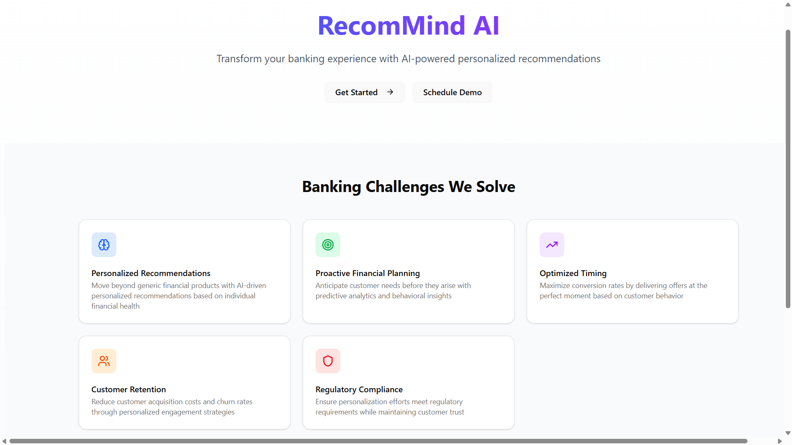
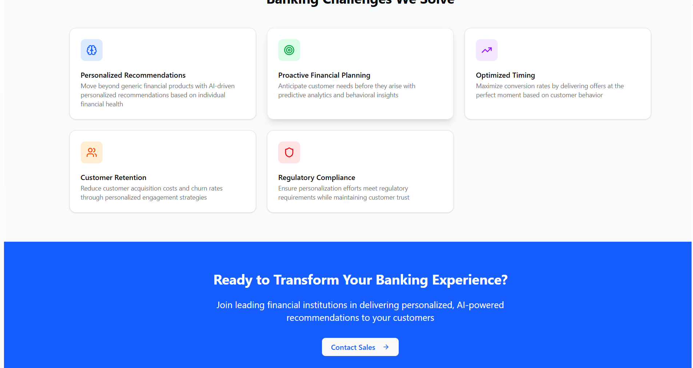
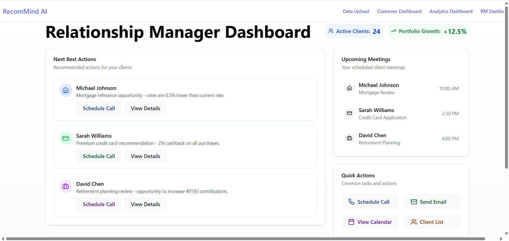
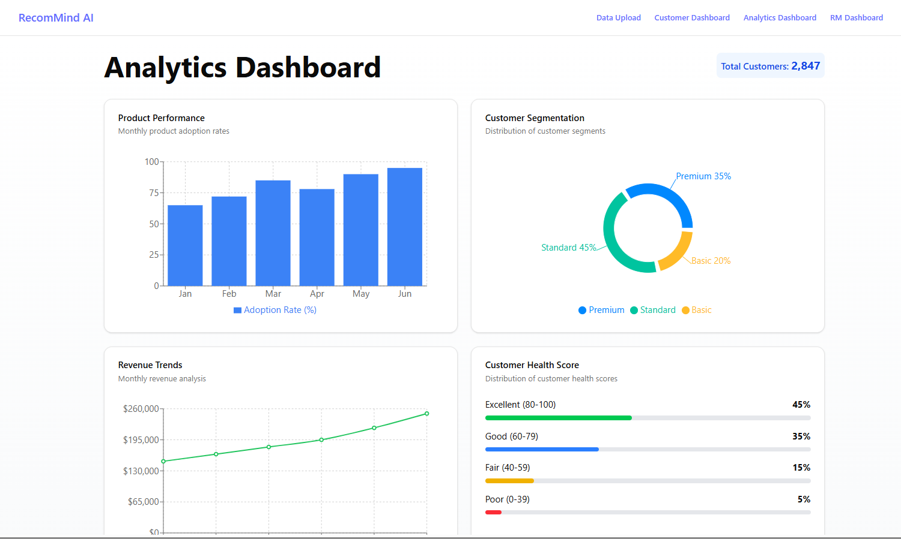
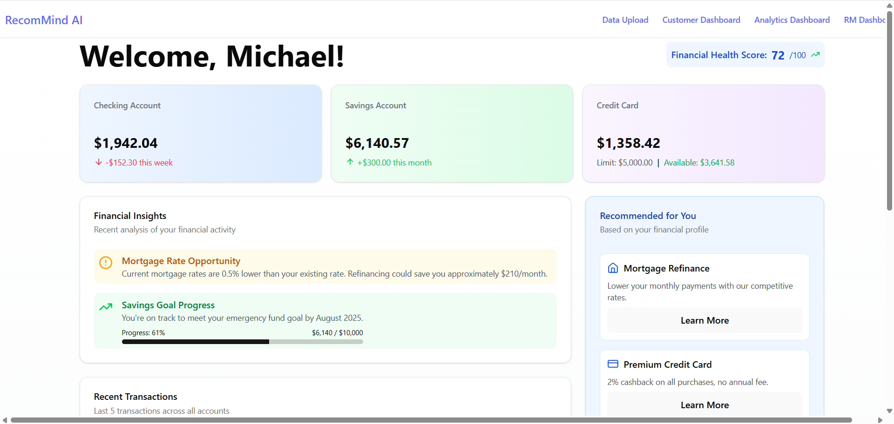
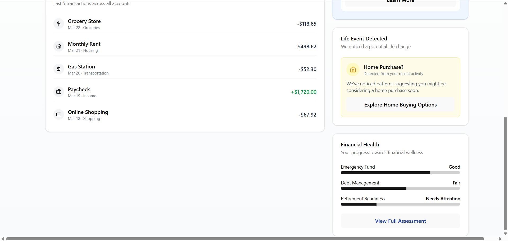
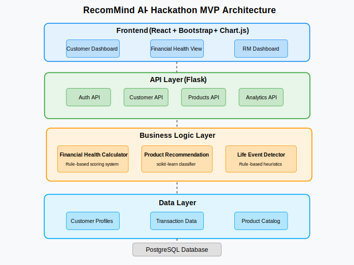
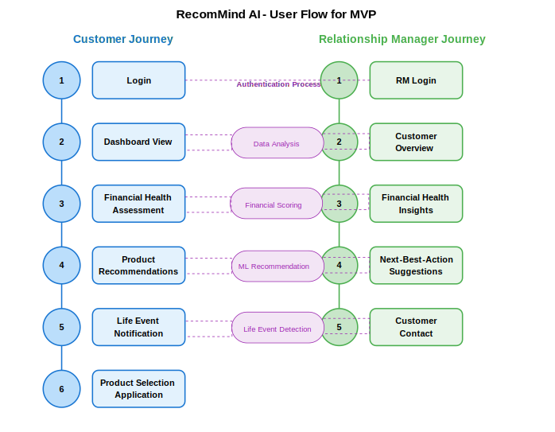

# 🚀 RecomMind AI: Hyper-Personalized Banking Recommendations

## 🎯 Project Overview

RecomMind AI is an innovative AI-driven solution that transforms banking experiences through hyper-personalized financial recommendations, addressing critical challenges in traditional banking systems.

## 💡 Problem Statement

Banks struggle with:

- Generic financial product recommendations
- Inability to anticipate customer needs
- Poor offer timing
- High customer acquisition costs
- Complex personalization compliance

## ✨ Key Features

- 🧠 AI-Powered Financial Health Assessment
- 🎯 Personalized Product Recommendations
- 🚨 Life Event Detection
- 📊 Relationship Manager Enablement

## 🖼️ Project Screenshots

<div style="display: flex; justify-content: space-between;">
    
    
    
    
    
    
    
</div>

## 🏗️ System Architecture

 

## 🛠️ Tech Stack

### Frontend

- React
- Shadcn/UI
- Tailwind CSS

### Backend

- FastAPI
- PostgreSQL
- Python Data Science Libraries

## 🚀 Quick Start

### Prerequisites

- Node.js (v16+)
- Python (v3.9+)
- PostgreSQL (v13+)

### Installation

1. Clone the repository

```bash
git clone https://github.com/your-username/recommind-ai.git
cd recommind-ai
```

2. Setup Backend

```bash
python -m venv venv
source venv/bin/activate
pip install -r requirements.txt
```

3. Setup Frontend

```bash
cd frontend
npm install
npm run start
```

## 💡 Key Innovations

- Adaptive Recommendation Engine
- Life Event Detection
- Financial Health Scoring
- Personalized Banking Experience

## 📊 Key Metrics

- Financial Health Score Calculation
- Customer Segmentation
- Personalization Accuracy
- Recommendation Conversion Rate

## 🔮 Future Roadmap

- Enhanced ML Models
- Real-time Recommendation Updates
- Advanced Sentiment Analysis
- Multi-modal Personalization

## 👥 Team

- **Bhagya Rana** - Project Lead
  - [GitHub](https://github.com/BhagyaRana)
  - [LinkedIn](https://www.linkedin.com/in/bhagyarana)

## 📄 Demo

- [Project Video Demo](https://drive.google.com/drive/folders/1viL_W_U4-pkYKNnHKzwdFctzSS0f3FnY?usp=sharing)

---

**Built with ❤️ for Banking Innovation**
